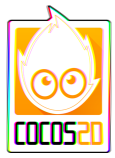

# E05: Chromatic

Here's a fun effect you see in games sometimes that makes it look like you are looking through a prism. It works by sampling the texture multiple times at slightly different places and then combines them back together.

<pre style="text-align:left;color:#000000; background-color:#ffffff; border:solid black 1px; padding:0.5em 1em 0.5em 1em; overflow:auto;font-size:small; font-family:monospace; ">void main(){
  float t = cc_Time[0];
  vec2 uv = cc_FragTexCoord1;
  float wave = 0.01;
  
  <em>// Sample the same texture several times at different locations.
</em>  vec4 r = texture2D(cc_MainTexture, uv + vec2(wave*sin(1.0*t + uv.y*5.0), 0.0));
  vec4 g = texture2D(cc_MainTexture, uv + vec2(wave*sin(1.3*t + uv.y*5.0), 0.0));
  vec4 b = texture2D(cc_MainTexture, uv + vec2(wave*sin(1.6*t + uv.y*5.0), 0.0));
  
  <em>// Combine the channels, average the alpha values.
</em>  gl_FragColor = vec4(r.r, g.g, b.b, (r.a + b.a + g.a)/3.0);
}
</pre>

## Exercises

* Experiment with other distortion patterns.
* See if you can figure out how to do more than just three colors/samples.
* Are there other ways to combine the colors together?
