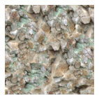

# E10: Water

Here's a practical animated water effect.

It's works like the earlier Sprite Distort example, but instead of using a trig function to distort the texture coordinates, we'll use colors out of another texture. Similar to how GLSL doesn't have special vectors for colors and positions, textures aren't really special either. You can treat a texture as containing colors, offsets, or a function lookup table. It's all just numbers to OpenGL.

Code time! We'll start with the vertex shader.

<pre style="text-align:left;color:#000000; background-color:#ffffff; border:solid black 1px; padding:0.5em 1em 0.5em 1em; overflow:auto;font-size:small; font-family:monospace; ">uniform vec2 u_NoiseTextureSize;

void main(){
  gl_Position = cc_Position;
  cc_FragColor = clamp(cc_Color, 0.0, 1.0);
  cc_FragTexCoord1 = cc_TexCoord1;
  cc_FragTexCoord2 = cc_TexCoord2;
  
  vec2 distortionScroll = vec2(cc_Time[0], 0.0);
  vec2 screen01 = (0.5*gl_Position.xy/gl_Position.w + 0.5);
  cc_FragTexCoord2 = screen01*cc_ViewSizeInPixels/u_NoiseTextureSize + distortionScroll;
}
</pre>

This should look familiar. It's not too different than the last one. On to the fragment shader.

<pre style="text-align:left;color:#000000; background-color:#ffffff; border:solid black 1px; padding:0.5em 1em 0.5em 1em; overflow:auto;font-size:small; font-family:monospace; ">uniform sampler2D u_NoiseTexture;
uniform sampler2D u_CausticTexture;

void main(){
  vec2 distortion = 2.0*texture2D(u_NoiseTexture, cc_FragTexCoord2).xy - 1.0;
  vec2 distortionOffset = distortion*0.05;
  
  gl_FragColor = cc_FragColor*texture2D(cc_MainTexture, cc_FragTexCoord1 + distortionOffset);
  gl_FragColor += 0.5*texture2D(u_CausticTexture, cc_FragTexCoord1 - distortionOffset);
}
</pre>

Nothing particularly new here, just new combinations.

## Exercises:

* Try experimenting with the noise texture. See if you can make different kinds of waves.